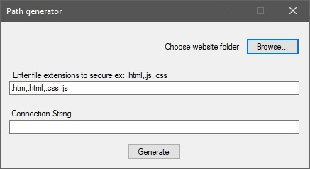
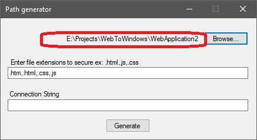
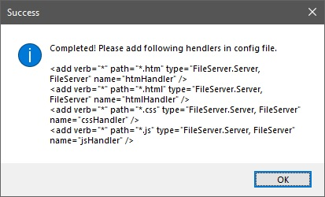

# FileProtector
A file protector for Asp.net website to secure confidential files.

File Protector project is to secure confidential  files in encrypted format to keep these files safe from downloading/surfing. We can secure any type of file using executable available in this repository. This works with asp.net web applications. This is under development for asp.net core website and not working for this version. To use this project to secure files a database connection is required as attached executable encrypts specified files and saves in database to protect.

<strong>How to Use:</strong>

<strong>1: </strong>Create a sql server database with any name. We can use our application database to keep encrypted files.

<strong>2:&nbsp;</strong>Extract <a id="50111028bbc61f195b5b459e07c52b7c-e0eac6a4a8eddff09464a3e22749acadbec30bf5" class="js-navigation-open " style="background-color: initial; box-sizing: border-box; color: #0366d6; font-family: -apple-system,BlinkMacSystemFont,Segoe UI,Helvetica,Arial,sans-serif,Apple Color Emoji,Segoe UI Emoji; font-size: 14px; font-style: normal; font-variant: normal; font-weight: 400; letter-spacing: normal; orphans: 2; text-align: left; text-decoration: none; text-indent: 0px; text-transform: none; -webkit-text-stroke-width: 0px; white-space: nowrap; word-spacing: 0px;" title="FileEncryptor.zip" href="https://github.com/ravisinghunnao/FileProtector/blob/master/FileEncryptor.zip">FileEncryptor.zip</a> and open FilePathGenerator.exe as below: 

<strong>3:&nbsp;</strong>Browse the folder within website/webapplicaiton folder whose files need to be encrypted.

<strong>4:</strong> In extensions field, enter comma seperated file extensions to encrypt.

<strong>5:</strong> Enter database connection string in connection string text box.

<strong>6:</strong> Press generate button.

After pressing generate button, executable will encrypt all files for given extensions in specified folder. after encrypting files, application will display a message as given below:

<strong>7:</strong> copy message and add handler values in web.config file as given below:

&lt;system.webServer&gt; &nbsp;&nbsp;&nbsp; &lt;handlers&gt;

&nbsp;&nbsp;&nbsp;&nbsp;&nbsp; &lt;add verb="*" path="*.htm" type="FileServer.Server, FileServer" name="htmHandler" /&gt; &nbsp;&nbsp;&nbsp;&nbsp;&nbsp; &lt;add verb="*" path="*.html" type="FileServer.Server, FileServer" name="htmlHandler" /&gt; &nbsp;&nbsp;&nbsp;&nbsp;&nbsp; &lt;add verb="*" path="*.css" type="FileServer.Server, FileServer" name="cssHandler" /&gt; &nbsp;&nbsp;&nbsp;&nbsp;&nbsp; &lt;add verb="*" path="*.js" type="FileServer.Server, FileServer" name="jsHandler" /&gt; &nbsp;&nbsp;&nbsp; &lt;/handlers&gt; &nbsp; &lt;/system.webServer&gt;

&nbsp;

<strong>8:&nbsp;</strong>Add following settings in app settings section of web.config file.

&lt;appSettings&gt; &nbsp;&nbsp;&nbsp; &lt;add key="FileServerConnectionString" value="ConnectionString for your database"/&gt; &nbsp;&nbsp;&nbsp; &lt;add key="FileServerHeader" value="a secure header for your confidiential files"/&gt; &nbsp;&nbsp;&nbsp;  &nbsp; &lt;/appSettings&gt;

&nbsp;

<strong>9:&nbsp;</strong>After making these changes in your web application, Add reference to FileServer.dll available in repository.&nbsp;

&nbsp;

<strong>10: </strong>Open global.aspx file and in application begin request add following code.

&nbsp;

  
&nbsp; internal protected void Application_BeginRequest(object sender, EventArgs e) &nbsp;&nbsp;&nbsp;&nbsp;&nbsp;&nbsp;&nbsp; { &nbsp;&nbsp;&nbsp;&nbsp;&nbsp;&nbsp;&nbsp;&nbsp;&nbsp;&nbsp;&nbsp; // Get objects. &nbsp;&nbsp;&nbsp;&nbsp;&nbsp;&nbsp;&nbsp;&nbsp;&nbsp;&nbsp;&nbsp; HttpContext context = base.Context;

  
//header name is static, we can modify header value in both web.config and in begin request.

  
&nbsp;&nbsp;&nbsp;&nbsp;&nbsp;&nbsp;&nbsp;&nbsp;&nbsp;&nbsp;&nbsp; context.Request.Headers.Add("FileServerHeader", "a secure header for your confidiential files"); &nbsp;&nbsp;&nbsp;&nbsp;&nbsp;&nbsp;&nbsp;&nbsp;&nbsp;&nbsp;&nbsp; // Complete. &nbsp;&nbsp;&nbsp;&nbsp;&nbsp;&nbsp;&nbsp;&nbsp;&nbsp;&nbsp;  &nbsp;&nbsp;&nbsp;&nbsp;&nbsp;&nbsp;&nbsp; }

  
&nbsp;

  
That's all.

  
&nbsp;

  
Web application will work as usual but now you can validate if request is coming from valid user.&nbsp;

